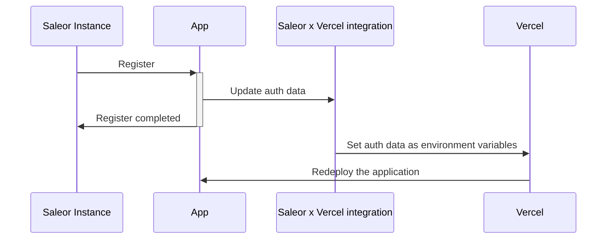

# APL - Auth Persistence Layer

APL is an interface for managing auth data of registered Apps. Implementing it does not restrict you from choosing the right technology for your project (for example Redis, Postgres, S3, etc.), and provides a common set of operations which can be used by your application and functions provided by App SDK.

## Available methods

- `get: (domain: string) => Promise<AuthData | undefined>` - If the entry for given domain exists, returns AuthData (`{ domain: string, token: string }`) object.

- `set: (authData: AuthData) => Promise<void>` - Save auth data.

- `delete: (domain: string) => Promise<void>` - Remove auth data fot the given domain.

- `getAll: () => Promise<AuthData[]>` - Returns all auth data available.

- `isReady: () => Promise<AplReadyResult>` - Check if persistence layer behind APL is ready. For example: database connection established

- `isConfigured: () => Promise<AplConfiguredResult>` - Check if persistence layer behind APL is configured. For example: env variable required by database connection

## AplReadyResult & ApConfiguredResult

Responses from `isReady()` and `isConfigured()` should match following:

```ts
type AplReadyResult =
  | {
      ready: true;
    }
  | {
      ready: false;
      error: Error;
    };

type AplConfiguredResult =
  | {
      configured: true;
    }
  | {
      configured: false;
      error: Error;
    };
```

## Example implementation

Let's create an APL, which uses Redis for data storage:

```ts
import { createClient } from "redis";
import { APL, AuthData } from "@saleor/app-sdk/types/apl";

const client = createClient();
await client.connect();

const redisAPL: APL = {
  get: async (domain: string) => {
    const token = await client.get(domain);
    if (token) {
      return { token, domain };
    }
    return;
  },
  set: async (authData: AuthData) => {
    await client.set(authData.domain, authData.token);
  },
  delete: async (domain: string) => {
    await client.del(domain);
  },
  getAll: async () => {
    throw new Exception("Not implemented.");
  },
};
```

You'll be able to use it directly:

```ts
import { redisAPL } from "./apl";

const createTestData = async () => {
  await redisAPL.set({ domain: "example.com ", token: "test-token" });
};
```

And with middleware from the SDK:

```ts
import { withRegisteredSaleorDomainHeader } from "@saleor/app-sdk/middleware";
import { redisAPL } from "./apl";

const handler = async (request) => {
  return Response.OK({ message: "If you see this, your app is registered!" });
};

// the middleware will reject request if it's domain has not been registered
export default withRegisteredSaleorDomainHeader({ apl: redisAPL })(handler);
```

### Using different APL depending on the environment

Depending on the environment your app is working on, you may want to use a different APL. For example during local development you might like to use `FileAPL`, because it does not require any additional infrastructure. Deployed apps on the other hand need more robust solution.

To handle both scenarios, initialize the proper APLs in your code based on it's environment. In your application code:

```ts
// lib/saleorApp.ts

import { FileAPL, VercelAPL } from "@saleor/app-sdk/APL";

// Based on environment variable the app will use a different APL:
// - For local development store auth data in the `.auth-data.json`.
// - For app deployment on Vercel with Saleor CLI, use vercelAPL.
export const apl = process.env.VERCEL === "1" ? new VercelAPL() : new FileAPL();
```

Now you can use it for in your view:

```ts
import { SALEOR_DOMAIN_HEADER } from "@saleor/app-sdk/const";
import { withRegisteredSaleorDomainHeader } from "@saleor/app-sdk/middleware";
import type { Handler } from "retes";
import { toNextHandler } from "retes/adapter";
import { Response } from "retes/response";

// import created APL
import { apl } from "@lib/saleorApp";

const handler: Handler = async (request) => {
  const saleorDomain = request.headers[SALEOR_DOMAIN_HEADER];

  // Get auth data
  const authData = apl.get(saleorDomain);

  // view logic...

  return Response.OK();
};

export default toNextHandler([withRegisteredSaleorDomainHeader({ apl }), handler]);
```

## Available APLs

### FileAPL

File based storage of auth data, intended for local development. Data are stored in the `.saleor-app-auth.json` file. You'll be able to develop app without additional dependencies or infrastructure.

Please note: this APL supports single tenant only (new registrations overwrite previous ones) and should not be used on production.

### VercelAPL

Single tenant APL dedicated for apps deployed on Vercel. To use this APL you'll need to deploy application from the Marketplace or use the [Saleor CLI](https://docs.saleor.io/docs/3.x/cli). This way the required `SALEOR_REGISTER_APP_URL` and `SALEOR_DEPLOYMENT_TOKEN` variables will be set up automatically during the first deployment. During the registration process Saleor's service will set up auth data in the environment variables and trigger the deployment:



If auth data are already saved in the environment, registration will proceed only if the domain of new request is the same as the previous one. This check is made to allow reinstalling the application possible and prevent unintended 3rd party to overwrite existing data. If you want to change the domain of registered Saleor domain, remove `SALEOR_DOMAIN` and `SALEOR_AUTH_TOKEN` environment variables from your Vercel project and redeploy it to refresh it's context.

### UpstashAPL

[Upstash](https://upstash.com) is a Redis SaaS targeting serverless applications. It's free tier is more than enough to start developing multi-tenant Saleor Apps, and credit card info is not required to create an account.

APL implementation use REST endpoints to store the data, so no extra dependencies are required.

To use UpstashAPL, you'll need endpoint URL and password. Both will be available at [dashboard](https://console.upstash.com/) after creating a database. Credentials can be passed to APL during it's creation:

```ts
import { UpstashAPL } from "@saleor/app-sdk/APL";

const apl = new UpstashAPL({
  restToken: "XXXXXXXXXXXXXX",
  restUrl: "https://eu2-red-panda-00000.upstash.io",
});
```

Or using environment variables: `UPSTASH_TOKEN`, `UPSTASH_URL`.
